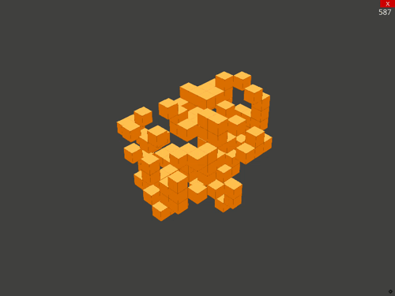

# Introduction

This is an implementation of the 3D version of [Game of Life](https://en.wikipedia.org/wiki/3D_Life).

The graphics is implemented using Python and [Ursina](https://www.ursinaengine.org/). The cell evolution is implemented as a CUDA kernel in CUDA C++. The kernel is called as a Python extension implemnted using [Cython](https://cython.org/).



# Prerequisites

- CUDA toolkit
- Python 3.6

# Installation

- Create a Python 3.6 virtualenv (e.g using conda) and activate it
- Install python requirements using
```bash
pip install -r requirements
```
- Build the python extension
```bash
cd evolve_cuda
./build_cython.sh
```
- Run the game from root dir
```bash
python main.py
```